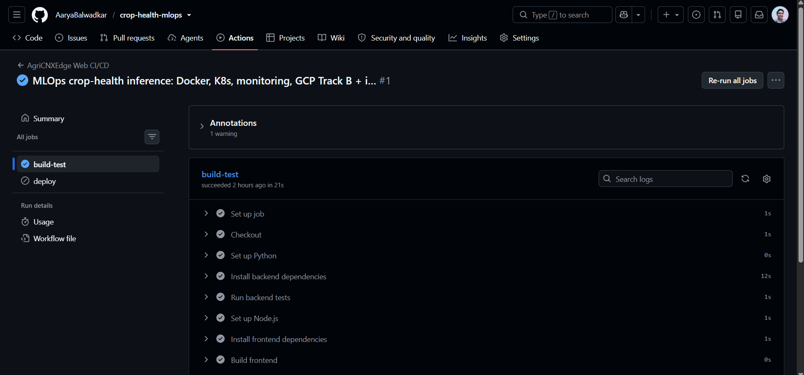
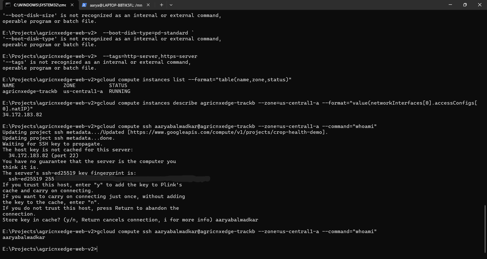
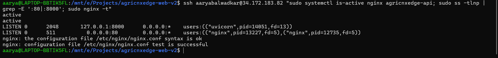
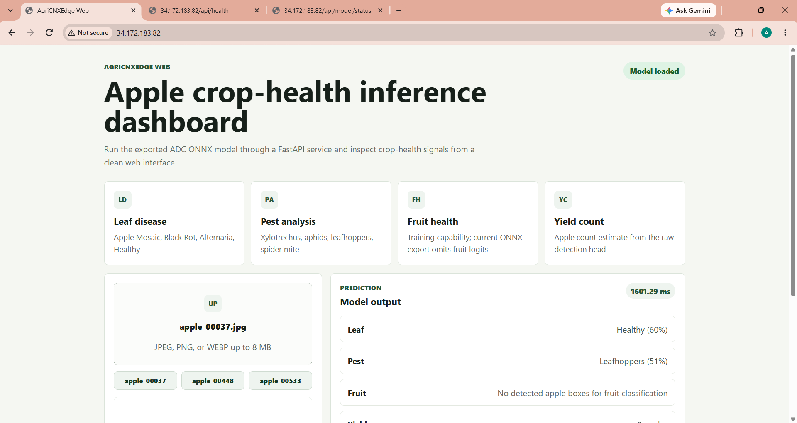
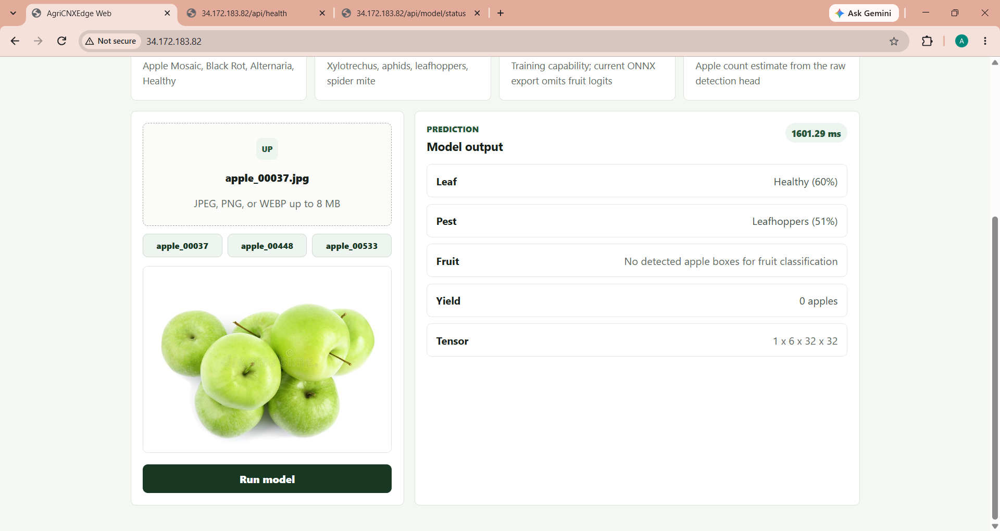
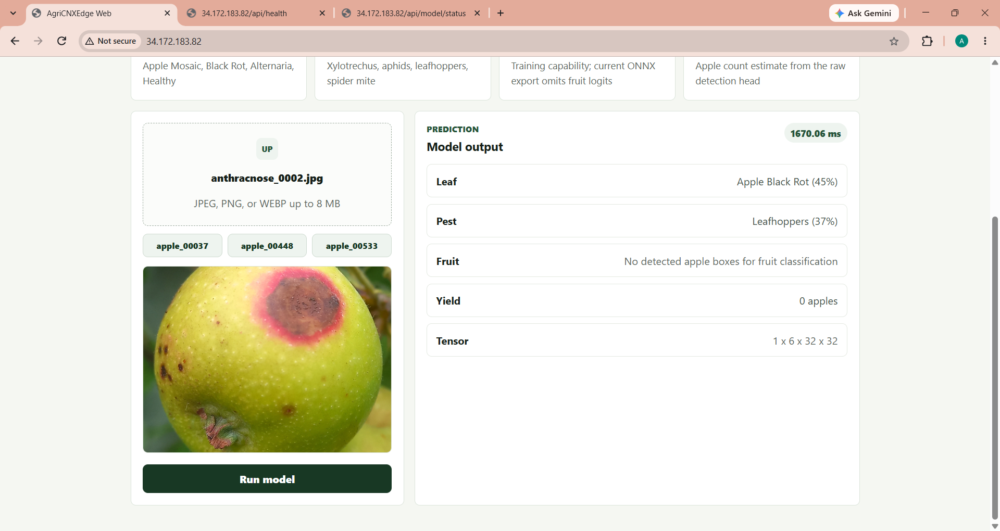
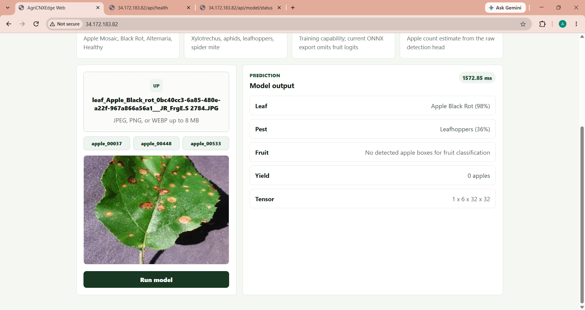
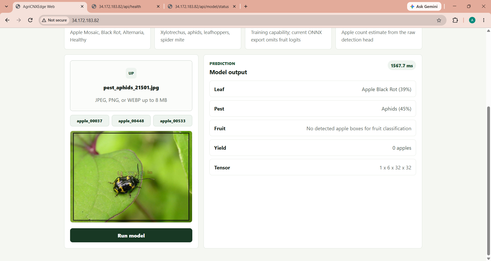
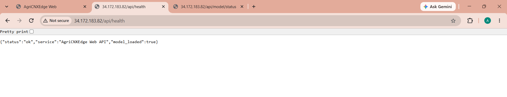
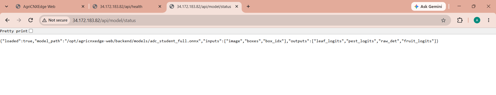

# Crop Health MLOps — ONNX Inference Platform

[](https://github.com/AaryaBalwadkar/crop-health-mlops/actions)

FastAPI + ONNX Runtime API serving a 126MB crop-health model (leaf, pest, fruit + yield boxes), with a React + Vite UI and a complete MLOps loop: CI/CD, Ansible, Docker, Kubernetes manifests, and Prometheus + Grafana monitoring.

## Overview

A single ONNX model runs 512×512 inference on CPU. The backend serves both the API and the built frontend from one origin, so there is no CORS friction in deployment. The same container image runs locally, on a VM, or on Cloud Run.

## Features

* Leaf, pest, and fruit classification plus apple detection boxes from one model
* Single-origin serving: UI and `/api` on the same port
* Prometheus metrics (`/api/metrics`) with Grafana dashboards
* Health and readiness probes shared by Compose and Kubernetes
* CI-gated builds with a production deploy kept behind an explicit flag

## Architecture

```text
Browser → Nginx (:80) → Vite dist (/) + FastAPI 127.0.0.1:8000 (/api/)
FastAPI → InferenceService → adc_student_full.onnx (CPU) → leaf / pest / fruit + boxes
FastAPI → /api/metrics → Prometheus :9090 → Grafana :3000
CI: GitHub Actions build-test → (gated) SSH deploy
VM: Ansible apt / nginx / systemd / swap → seed code + dist + model → systemctl restart
```

| Layer | Technology |
|---|---|
| UI | React 19 + Vite |
| API | FastAPI + Uvicorn |
| Inference | ONNX Runtime (CPU), Pillow, NumPy |
| CI/CD | GitHub Actions |
| Config management | Ansible |
| Containers | Docker, Docker Compose |
| Orchestration | Kubernetes manifests (kind-ready) |
| Monitoring | Prometheus, Grafana |
| Demo cloud | GCE `e2-micro` (Always Free) |

## Repository map

| Area | Path |
|---|---|
| UI entry | `frontend/src/App.jsx` |
| API client (same-origin) | `frontend/src/lib/api.js` |
| Dev proxy | `frontend/vite.config.js` |
| App factory (serves UI + API) | `backend/app/main.py` |
| Routes (`health`, `model/status`, `predict`, `metrics`) | `backend/app/api/routes.py` |
| Inference service | `backend/app/services/inference.py` |
| Settings | `backend/app/core/config.py` |
| CI pipeline | `.github/workflows/ci-cd.yml` |
| Ansible playbook | `ansible/playbook.yml` |
| GCP inventory template | `ansible/inventory.gcp.ini` |
| Systemd unit template | `ansible/templates/agricnxedge-api.service.j2` |
| Nginx template | `ansible/templates/nginx-agricnxedge.conf.j2` |
| Container image | `Dockerfile` |
| Local monitoring stack | `docker-compose.yml` |
| K8s manifests | `k8s/` |
| Prometheus + Grafana config | `monitoring/` |
| GCP helpers | `scripts/gcp-trackb.ps1`, `scripts/gcp-trackb.bat`, `scripts/deploy-trackb.sh` |
| Model (gitignored, 126MB) | `backend/models/adc_student_full.onnx` |

The model file is never committed. It is injected at runtime via a mounted volume, `scp`, or object storage.

## Quickstart

### Option A — Local API + UI

From a clean clone, set up the backend environment, install dependencies, and run the API from the repository root or backend directory.

```bash
cd backend
python -m venv .venv
.venv\Scripts\activate
pip install -r requirements.txt
python -m pytest -q
python -m uvicorn app.main:app --reload --port 8000
```

If you also want the frontend dev server:

```bash
cd frontend
npm install
npm run dev
```

Open the Vite URL printed in the terminal. The model artifact is optional for health checks and status routes; prediction requests require a valid ONNX model under `backend/models/`.

### Option B — Docker monitoring stack

Requires Docker Desktop or Docker Engine running.

```bash
git clone <repo>
cd crop-health-mlops-main
docker compose up --build
```

| Service | URL |
|---|---|
| App | http://localhost:8000/ |
| API health | http://localhost:8000/api/health |
| Metrics | http://localhost:8000/api/metrics |
| Prometheus | http://localhost:9090 |
| Grafana | http://localhost:3000 (admin / admin) |

### Option C — Traffic generation

Generate a realistic synthetic workload against the running API:

```bash
python traffic_generator.py --url http://localhost:8000 --count 100 --delay 0.2
```

This exercises health checks, model status, valid prediction uploads, and invalid image rejections while printing the request number, endpoint, and HTTP status.

### Option D — Kubernetes (kind)

```bash
docker build -t agricnxedge-web:latest .
kind create cluster --name agricnxedge
kind load docker-image agricnxedge-web:latest --name agricnxedge
kubectl apply -f k8s/namespace.yaml -f k8s/api-deployment.yaml -f k8s/api-service.yaml
kubectl -n agricnxedge port-forward svc/agricnxedge-api 8000:80
```

### Option E — GCP test-and-drop VM

Free-tier combo only: `us-central1`, `e2-micro`, 30GB `pd-standard`.

Create the VM (CMD):

```bat
scripts\gcp-trackb.bat create
```

Copy the printed IP into `ansible/inventory.gcp.ini`, then run Ansible from WSL2 Ubuntu:

```bash
ansible -i ansible/inventory.gcp.ini webservers -m ping
ansible-playbook -i ansible/inventory.gcp.ini ansible/playbook.yml
bash scripts/deploy-trackb.sh <VM_IP> <GCE_USER>
```

Verify:

```text
http://<VM_IP>/
http://<VM_IP>/api/health
http://<VM_IP>/api/model/status
```

Delete the same day (CMD):

```bat
scripts\gcp-trackb.bat delete
```

## Screenshots

### CI



GitHub Actions `build-test`: backend `pytest` plus the Vite production build.

### Ansible provisioning



`ping` reachability plus the full playbook run: `ok=13 failed=0`.

### VM runtime



Service state, Nginx config check, swap, and localhost health probe.

### App inference











### API





### Pending

* GCP console (`e2-micro us-central1-a`, firewall) — pending
* Docker + Prometheus + Grafana — pending
* Kubernetes — manifests ship in `k8s/`; cluster screenshots pending

## Troubleshooting

Real errors hit during this build, kept as a reference. Each entry states the error, the cause, and the fix.

### E1 — Script opens in Notepad

Error:

```text
Get-ExecutionPolicy is not recognized as an internal or external command
```

Cause: the command ran in CMD, which has no PowerShell cmdlets and hands `.ps1` files to Notepad.

Fix: in CMD use the batch wrapper; in PowerShell bypass the policy once:

```bat
scripts\gcp-trackb.bat create
```

```powershell
powershell -ExecutionPolicy Bypass -File .\scripts\gcp-trackb.ps1 -Project crop-health-demo -Zone us-central1-a -Action create
```

### E2 — Backtick continuations fail in CMD

Error:

```text
Invalid value for field 'resource.name': '`'
'--zone' is not recognized as an internal or external command
```

Cause: PowerShell `` ` `` line continuations pasted into CMD execute as separate commands.

Fix: run single-line commands in CMD, or type `powershell` first to switch shells.

### E3 — Instance not found

Error:

```text
The resource 'projects/.../instances/agricnxedge-trackb' was not found
```

Cause: the VM was never created, or the project name was used where the project ID was required.

Fix:

```bat
gcloud projects list --format="table(projectId,name)"
gcloud compute instances list --format="table(name,zone,status)"
```

### E4 — SSH host-key prompt answered wrong

Error: the connection cancels at `Store key in cache? (y/n)`.

Cause: a username was typed instead of `y`.

Fix: answer `y`, wait ~30s for key propagation, and re-run the same `gcloud compute ssh` command.

### E5 — Ansible ping hangs

Symptom: no output for 10+ minutes.

Cause: WSL `~/.ssh` does not contain the Windows-generated `google_compute_engine` key, so SSH waits on a password prompt indefinitely.

Fix:

```bash
cp /mnt/c/Users/Aarya/.ssh/google_compute_engine ~/.ssh/ && chmod 600 ~/.ssh/google_compute_engine
timeout 25 ssh -i ~/.ssh/google_compute_engine -o ConnectTimeout=10 aaryabalwadkar@<IP> whoami
timeout 120 ansible -i ansible/inventory.gcp.ini webservers -m ping
```

### E6 — Frontend build fails in WSL

Error:

```text
SyntaxError: The requested module 'node:util' does not provide an export named 'styleText'
```

Cause: WSL ships Node 18; Vite 8 requires Node 20+.

Fix: build on Windows (Node 22+) and keep WSL for Ansible/SSH only:

```bash
cd frontend && npm run build
```

### E7 — Model upload stalls

Symptom: `scp` of the 126MB model stalls at 0%.

Cause: transient throughput dips on long-haul transfer. Retry; the successful seed took under 4 minutes. One-time cost only.

### E8 — Reachable locally, unreachable externally

Symptom: VM-local `curl 127.0.0.1` returns 200 while external `curl` times out.

Cause: the `allow-http` firewall rule targets the `http-server` tag, which the VM was missing.

Fix:

```bat
gcloud compute instances add-tags agricnxedge-trackb --zone=us-central1-a --tags=http-server,https-server
```

Always confirm the machine type still reads `e2-micro` to stay inside free tier.

### E9 — Browser reports unreachable on a healthy server

Cause: Chrome upgrades the URL to `https://`, which the demo does not serve, or shows a stale error page.

Fix: type `http://` explicitly, retry in Incognito or Edge, and confirm outside the browser:

```bat
curl http://<IP>/api/health
```

### E10 — Docker / kind unavailable

Symptom: `docker build` cannot reach the daemon; cluster screenshots pending.

Fix: start Docker Desktop and re-run `docker build` plus `docker compose up --build`. Kubernetes screenshots attach later with no structural changes.

## Design decisions

* **Single-origin serving.** FastAPI serves the Vite build and the API on one port, removing CORS configuration from every deployment target.
* **Model outside git.** The 126MB artifact stays out of version control and the container image, keeping the image under free registry limits. It arrives via volume, `scp`, or object storage.
* **Ansible for OS, API calls for cloud.** Ansible owns everything inside the machine (packages, users, Nginx, systemd, swap). Cloud objects (VM, firewall, registry, revisions) belong to `gcloud`/Terraform — Ansible cannot deploy serverless targets.
* **SSH deploy is intentionally gated.** The CI `deploy` job stays skipped behind `ENABLE_DEPLOY` until a permanent server with stored secrets exists. Throwaway VMs use the seeded `scp` path instead, which also sidesteps the 1GB build bottleneck.
* **One health endpoint everywhere.** `/api/health` backs the Docker healthcheck and the Kubernetes liveness/readiness probes.

## Cost note

The GCP demo is shaped for Always Free: one `e2-micro` in `us-central1`, 30GB standard disk, ephemeral IP, ~1GB egress budget. A few-hours run consumes a fraction of one percent of the monthly allowance. Set a $1 budget alert before creating anything and delete the VM, disk, and address the same day.

## Future work

* Bake the model via object storage for Cloud Run revisions
* GitHub → GCP deploys over Workload Identity Federation (no stored keys)
* Helm-managed monitoring with ServiceMonitors
* Auth and rate limits on `/predict`
* ARM validation for high-memory free-tier instances
